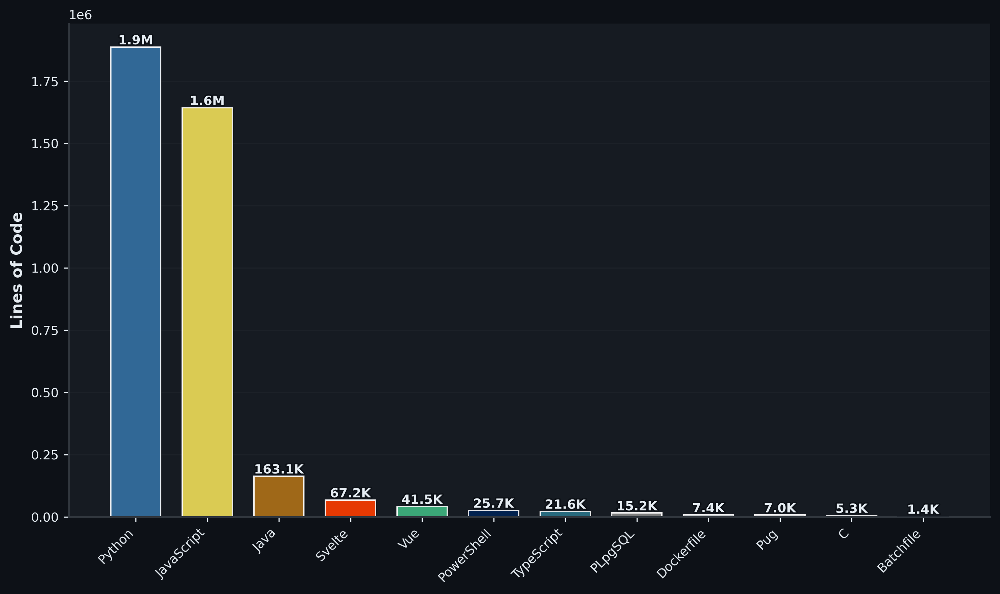
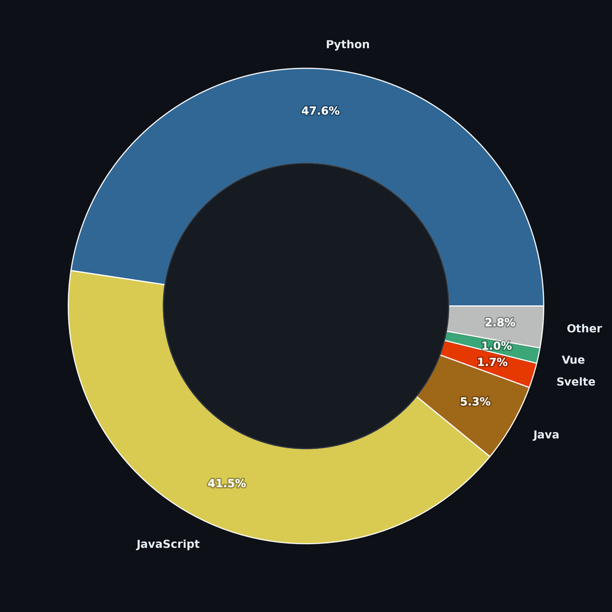

### :wave: Hey there, I’m Georgi Tashev

</> I'm currently learning Java.  
:star: I like hiking, puzzles, escape rooms, board games and computer games.  

## Languages and Tools I use:

&nbsp;&nbsp;&nbsp;
&nbsp;&nbsp;&nbsp;
&nbsp;&nbsp;&nbsp;
&nbsp;&nbsp;&nbsp;
&nbsp;&nbsp;&nbsp;
&nbsp;&nbsp;&nbsp;
&nbsp;&nbsp;&nbsp;
&nbsp;&nbsp;&nbsp;
&nbsp;&nbsp;&nbsp;
&nbsp;&nbsp;&nbsp;
&nbsp;&nbsp;&nbsp;
&nbsp;&nbsp;&nbsp;
&nbsp;&nbsp;&nbsp;

  

  

<h1>Lines of Code (Excluding HTML and CSS)</h1>

 

     
    &nbsp;
    &nbsp;
    &nbsp;
    

